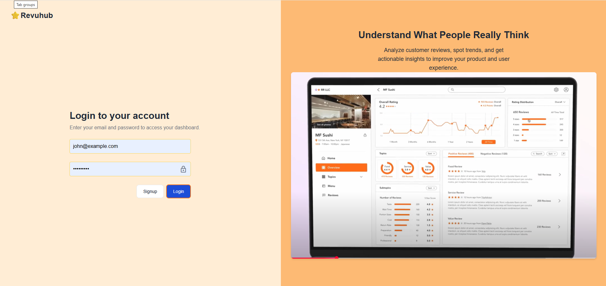
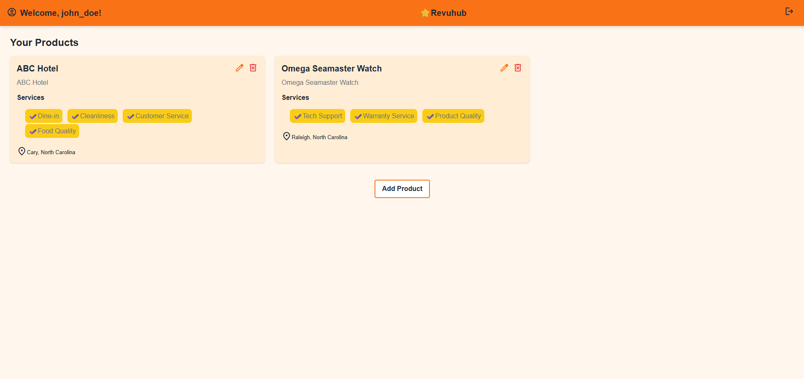
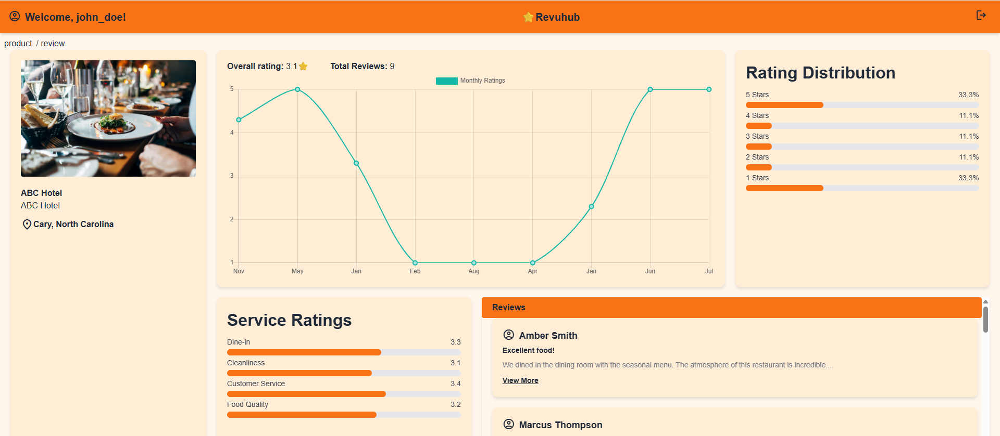

# Revuhub - Review Aggregator Frontend

Revuhub is a review analytics platform that helps users get insights from aggregated reviews across various sources.

## Website link
[RevuHub](https://review-dashboard-client.onrender.com/)

#### This is the frontend built with

   

## 🛠️ Backend Codebase (Node.js + Express)

[https://github.com/JeevithaPugazh/review-dashboard-server](https://github.com/JeevithaPugazh/review-dashboard-server)

## 🚀 Getting Started

#### 1. Clone the repository:

```bash
git clone https://github.com/JeevithaPugazh/review-dashboard-client.git
```

#### 2. Install dependencies:

```bash
npm install
```

#### 3. Start the development server:

```bash
npm start
```

## ✨ Features

- User registration and login
- Auth-protected pages
- Built using React and React Router
- Product list, detail, add/edit/delete product
- Dynamic Review Dashboard
- Displays visual analytics using Chart.js.
- Click on any product to view detailed reviews and analytics.
- Styled with Tailwind CSS for a modern and responsive UI.

## 🧪 To-Do

- Filter reviews by keyword or topic

- Add sentiment analysis

## 📸 Screenshots




